This guide covers common operations and best practices prepared by Oliver Wyman Actuarial Consulting for the 2020 CAS Ratemaking, Product and Modeling meeting. It is meant to be used in addition to the content from our session **0 to Git: Open Source for Actuaries** and assumes a basic understanding of Git.

> **Keep  Calm!** This guide may seem like a lot, but  once you use Git for a few weeks it will become second-nature. Git will usually  prevent you from doing anything wrong.  

There is a rich Git community online. In addition to this guide you can use Google to find out how to do things in Git. 

*PROVIDED AS-IS: we do not make any guarantees regarding the content.*

# Table of Contents

**[What is Git?](#what-is-git)**<br>
**[Vocabulary](#vocabulary)**<br>
**[Installation](#installation)**<br>
**[Starting a Project](#starting-a-project)**<br>
**[Stage, Commit, Push](#stage-commit-push)**<br>
**[Collaboration on Code](#collaboration-on-code)**<br>
**[Special Considerations](#special-considerations)**<br>

# What is Git?

Git is version control and collaboration software that supports the open source software community. We use it to make collaboration on code easy - for everything from contributing and sharing updates to reporting bugs.

Using Git will seem strange at first. The vocabulary and methods are unique. 

*Very soon, you'll wonder how you ever got by without Git!*

**Git isn’t one program**. It is an underlying technology. You can use many programs to work with the underlying technology including: 

* Git Bash can do just about anything but requires executing code
* Git GUI
* GitHub Desktop
* Rstudio
* Visual Studio Code.

Github and Bitbucket are online platforms for collaborating with Git in a team.

> Refer to our session’s materials for more background on Git.

# Vocabulary

Here are some terms we’ll be using a lot.

* **Local** On your computer or a network share (ideally, on your computer since a network share can be slow and other people can break your code). This is your working directory, the location of the files you open, change, etc.

* **Remote/Server/Online/Cloud** Refers to GitHub (which is NOT the same thing as Git) in this guide, and to the repository saved on GitHub. Bitbucket is an alternative to GitHub (others exist, too).
* **Repository** (Repo) A project including files and git data, including branches, prior versions, and commits. Lives in multiple places including online/cloud/server (GitHub) and on your PC.
* **Clone** Download files from GitHub to your computer. A new remote repo is not created.
* **Fork** Copy an existing repo and create a new repo that you own. Keeps a link to the original repo so you can quickly compare and merge changes.
* **Branch** Not typically recommended. Create changes on a repo without affecting the main code. A new repo is not created.
* **Diff** The difference in a file between the current version and the last time it was staged/committed.
* **Stage** Prepare a change to be committed. It graduates your change to a finished change so it doesn’t’ show up in diffs.
* **Commit** A change or set of changes to files, also a version of a repo. Typically includes changes that have been verified as working or otherwise complete.
* **gitignore** A file that tells Git which files to ignore. We ignore large or sensitive files. Large files will slow down git operations and could exceed storage limits on GitHub. Although GitHub is secure, we prefer to store sensitive data on our internal network/VPN for enhanced security whenever possible.

# Installation

You’ll want to have these tools set up. For simplicity, this guide assumes we use Git Bash, VS Code, and GitHub. This is the best-practice toolset we use at our company.

**Git**

* Download and install from https://git-scm.com/book/en/v2/Getting-Started-Installing-Git
* Use defaults. This will install Git and Git Bash (and Git GUI but we don't use it).

**Visual Studio Code**

VS Code is a powerful integrated development environment (IDE), text editor, and Git manager. It will give you access to visual elements of Git and help us manage diffs and commits.

* Download and install from https://code.visualstudio.com/download
*  Make sure to choose **Add Open This Folder to Context Menu** (not the default) or similar option. Otherwise, choose defaults.
* When you first use VS Code with Git, it’ll ask you if you want it to periodically check for updates to the remote. We recommend not doing this, as it can slow down your work.

**GitHub**

You’ll need to choose a service that will host your remote repositories. Choose a service and register an account there. This guide assumes GitHub, but there are other similar options (Bitbucket). 

*If you don't need to share code, you can use many of the Git features without connecting to GitHub.*

## Best Practice Toolset

It might be useful to know our best-practice when tooling for code-based projects.

* We **prepare templates** for different types of projects and start our projects by forking a template from GitHub. This way we don't have to do repetitive setup tasks like creating folders and common functions.
    * Clone (download) your fork to your local machine (the Documents folder is a good place), NOT a shared network, for speed and to discourage sharing files and not using version control.
    * Put data in a shared network folder and refer to it in your code. Your colleagues should be able to clone and run your code.
* Edit code with Visual Studio Code (VS Code). Run code in your code-specific program (RStudio, Python). VS Code can be set up to run code but it can be difficult to set up this feature and keep it running.
    * VS Code and Git Bash can be opened from a folder by right-clicking in File Explorer. Their operations are location-specific so always use this method.
* Use the search functionality (click search or ctrl + shift + F), and ctrl + p for searching by file name. Similar for find-and-replace operations (ctrl + shift + H).
    * Break code into files and use `easyr::runfolder` or similar to run them in order. easyr is an R package. Your code files should never have more than ~300 lines.
    * Use descriptive lower-case file names (easy to type) so things are easy to find.
    * Use the VS Code extension **Open File in App** to quickly move from VS Code to RStudio when you need to run code.
    * Leverage the Source Control tab to view changes made, and then commit changes when you are finished.

VS Code is the preferred place to interact with Git (stage, commit, push, pull), but often it can’t perform necessary operations, in which case you’ll use Git Bash instead.

## Open Folder in VS Code

VS Code is folder-based so you need to open it inside your project folder.

* Go to your project folder and right-click in the empty space in the folder, click "Open with Code" or similar.
* Alternatively, you can right-click on the folder itself.

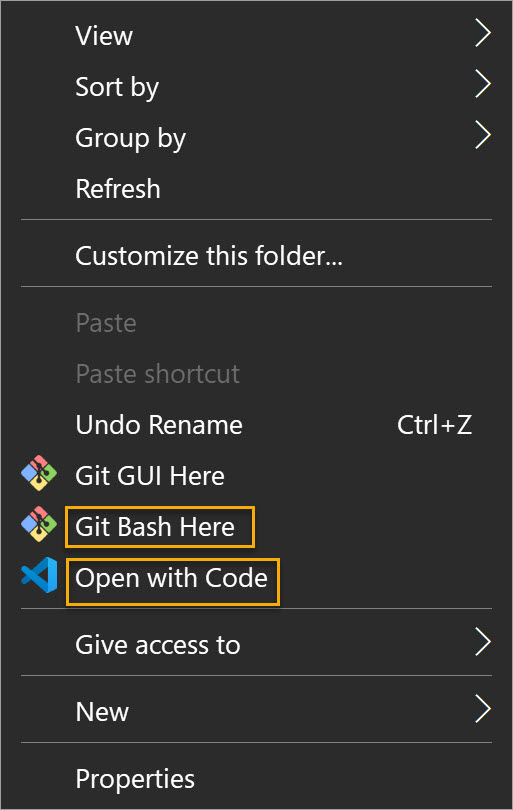

* Click the Source Control tab (or ctrl + shift + G). This is where you access Git-enabled features.

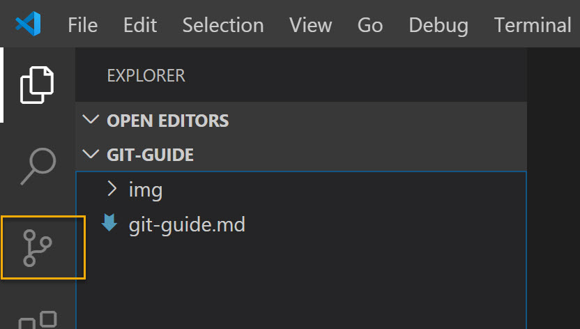

* Then run operations as described throughout this document. For example: review changes made since the last commit by clicking on any file showing as modified (M). Make sure you are using the search functionality and the ctrl+p flex filename search to quickly find files and variable references.

## Open Folder in Git Bash

Git Bash is also folder based. Go to your project folder and right-click in the empty space in the folder, click "Git Bash Here" or similar.

Alternatively, you can right-click on the folder itself.


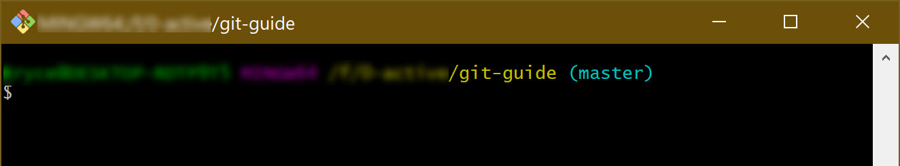

Then run operations described throughout this document.

# Starting a Project

How you start a project will depend on where your files are coming from and whether or not you want to use an online repo. Remember, you can use Git offline. You don't necessarily have to use a remote.

Common operations are below. Follow the steps that apply to your situation:

If you **don't want to use a remote**:

* No files or you want to start from local files? Initialize a Local Repository without GitHub
* Want to start from an existing GitHub repository? Clone a Remote 

If you **do want to use a remote**:

* No files? Initialize a Remote > Clone a Remote 
* Starting from local files? Initialize a Remote > Initialize a Local Repository with GitHub.
* Want to start from an existing GitHub repository? Fork a Remote > Clone a Remote 

## Initialize a Local Repository without GitHub

If you just want to track your changes offline, you can use a local repository. 

*If you do want a remote, it is slightly easier to initialize the remote and then clone it.*

Follow these steps. They'll work whether or not you already have files.

* If you don't already have one: create a folder to store your files.
* Right-click in the folder and Open with Code. Then, click the Source Control tab.


* Click the + button to initialize the repository.

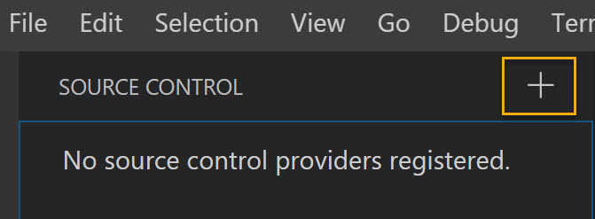

*You can also do this by opening Git Bash in the folder and running* `git init`

## Initialize a Remote

If you do want a remote, it is slightly easier to initialize the remote and then clone it. Follow these steps to create a new remote repository.

* Log in to GitHub.

* Click New on the left.

  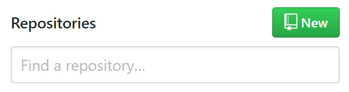

* Pick a Repository name and set a Description and choose Public or Private. 

* If you don't have any files yet: Check the box for `Initialize this repository with a README`. 

  * It is a good idea to provide contextual and important information in the README file. GitHub will show the contents of this file to anyone who accesses your repository.
  * If you already have local files you'd like to use: Leave it un-checked. Your repo must be blank in order to push your files to it later. You can easily add a README later.

* Click **Create repository**

## Initialize a Remote Repository with GitHub

* If you left `Initialize this repository with a README` unchecked, you'll see some Git Bash code when you access the project GitHub page. Copy the code labeled *…or create a new repository on the command line*. 
* Go to your project folder and right-click in the empty space in the folder, click "Git Bash Here" or similar.
* Paste the code into the Git Bash window with `shift+insert` or `right-click > paste` and press Enter to run it. The code will initialize your local repo, create a README, set your GitHub project as the origin remote, and make an initial commit and push.

## Fork a Remote

If you want to start from an existing project on GitHub, you can Fork it.

* Go to the GitHub page and click Fork at the top right.


* GitHub will take minute and create a repo for you. It'll be owned by you and contain all the Git history from the original project.
* Follow the steps to [Clone a Remote Repository](#clone-a-remote-repository) to clone the files to your computer.

## Clone a Remote

To get a local repo we can work with, we clone (download) the remote. Only do this if you don't have any local files.

* Go to the project's GitHub page.
* Click **Clone or download** on the top right and then click the copy button to copy the repo location.

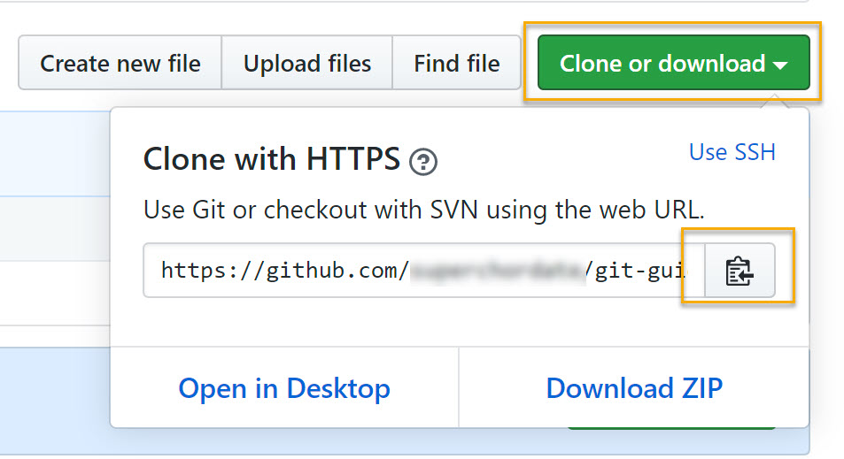

* Go to the folder you want to put your project folder in. Do not create your project folder - Git will do this for you.
* Right-click in the empty space in the folder and click "Git bash here" or similar.


* Type `git clone ` and paste the remote location by pressing `shift + insert` or `right-click > paste`

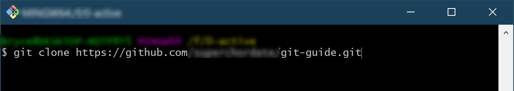

* Press `Enter`. Git will work and when it is finished you'll have your local files.

#  Stage, Commit, Push

Once your local and remote (if you have one) repositories are initialized, the process of making changes goes like this:

1.   Make changes.
2.   Review and **stage** the changes you want to commit. Sometimes I'll stage a change before it is finished to create an intermediate save/compare point.
3.   **Commit** staged changes, including saving a commit message to describe what the change does. A commit will often contain multiple related changes.
4.   **Push** commit(s) to GitHub. You can do multiple commits before pushing, but you should push often if others are relying on your changes. 

In Git, any changes initially start as **un-staged changes** or **diffs**. You can review changes made since the last commit at the Source Control tab (or ctrl + shift + G) in VS Code.

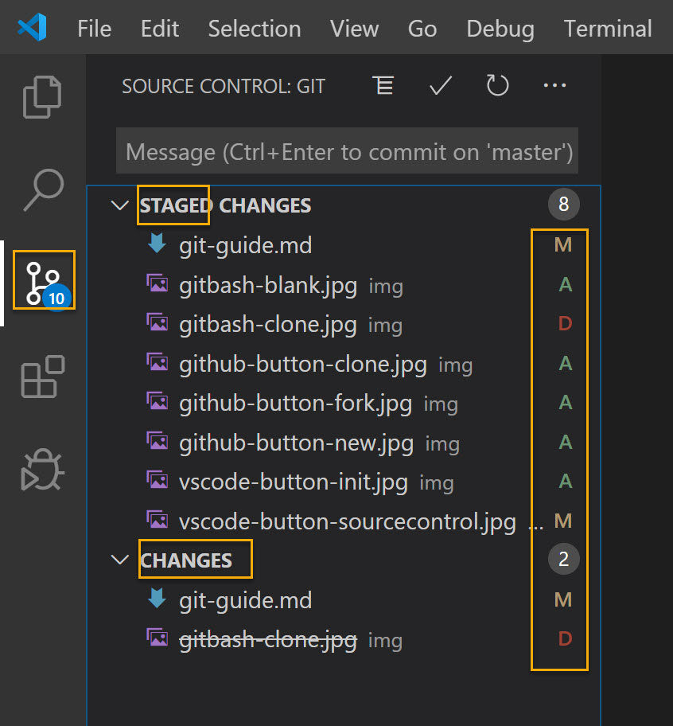

Letters on the right indicate the type of change: D = deleted, M = modified, U = untracked (added), C = conflict. 

Click on a file to see changes side-by side. This view is a game-changer: quickly review your changes, and you can copy from left (old) to right (new) if you want to undo changes. You can also select changes and right-click to revert or stage specific lines.

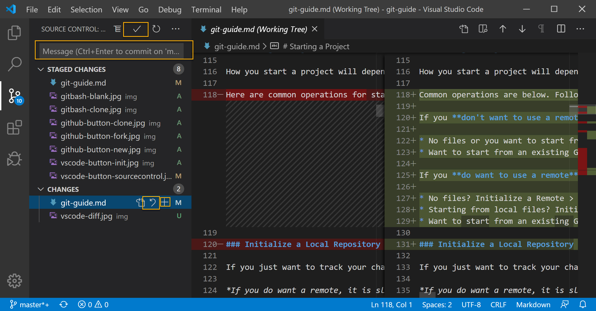

Click the undo button next to  a file name to revert to the prior committed version of the file.

**Stage** files by clicking the + button. 

When you are ready to **commit** changes, review the diff and run your code to make sure the changes are ready. Then stage the changes and type a commit message in the box to describe what you did. See [this article ](https://chris.beams.io/posts/git-commit/)on writing a good message.

Press `ctrl+enter` or click the checkmark button to perform the commit.

> **To commit or not to commit**? It is up to you when and how often you want to commit. Best practice is to commit as often as you can, but only after your changes are finished and tested as working. You’ll learn over time how you prefer to commit.

When you are ready to **push** your changes, you can do so by clicking the ... menu in the Source Control tab in VS Code and select Push.

I actually prefer to do it in Git Bash though. When you push in VS Code you don't get much feedback/confirmation. Git Bash will give you more information about the push operation. 

To use Git Bash, open it in the folder and run `git push`. 

# Collaborating on Code

When you are ready to share your code or contribute to a project, Git provides powerful tools for removing barriers.

At a high level, it works like this:

* You share your repository (or someone share theirs) either by adding collaborators or making it public.
* Collaborators work separately and push changes to the remote.
* You cannot push unless you have pulled the latest version (Git will give you an error). This ensures everyone is working on the same version of the code.
* If you pull code that conflicts with changes you've made (because you and a collaborator both changed the same code in different ways) then you must resolve the conflict. Git and VS Code will help you do this.
* Collaborators can follow the repo to get emailed when the code changes or bugs are reported.

## Sharing Your Repo

Manage sharing under Settings > Manage access. 

* If your repo is public, anyone will be able to see it but only collaborators will be able to make edits.
* If your repo is private, only collaborators will be able to see your project and edit it.
* Always give the minimum level of access necessary. 
* Bitbucket has different security options for free accounts.

## Pulling Changes

If a colleague pushes a change to GitHub and you want to bring the change into your local code, follow these steps. 

>  Follow remote repos so you get emailed when changes occur and a pull is required.

* Commit any open changes. Typically, you should only pull once you have a clean workspace with all changes committed.
* Review the change to the remote by navigating to the repo at GitHub > click Code > # commits. Click the Commit message to see the changes. There may be multiple commits.
* Open the project in Git Bash and run `git pull`. Git Bash will print out a high level summary of changes.
* A few things may happen when you pull:
  * If it doesn't show any errors or ask for any input, it worked and you are done!
  * If you get a merge conflict, see the section [Resolve Merge Conflicts](#resolve-merge-conflicts).
  * If it mentions un-committed changes being a problem, commit any changes or use `git stash` to temporarily undo them, run `git pull`, and then `git stash pop` to get your changes back.
  * If you see the screen below, type `escape` > `escape` > `:x!` > `enter`. This is how you save and exit using this text editor.

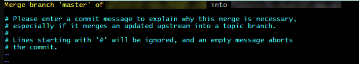

*You can also do this in VS Code but, similar to push, you don't get much information there. I prefer to use Git Bash for push and pull operations.*

## Pulling Changes From Another Repo

If you forked a repo and someone applies a fix to the code you forked, you may want to bring that change into your project.

> **Tip**: Follow the repo you forked to get alerted when it changes.

Modify and run the code below in Git Bash. You may get an error adding the remote if you have already done so. That's fine, continue with the next 2 lines.

```git
git remote add source https://repo-url.git  
git fetch source
git merge source/master
```

From here follow the steps for [Pulling Changes](#pulling-changes) to resolve any message you see. 

When you are done, it is highly recommended you push your changes to update the remote.

## Resolve Merge Conflicts

VS Code provides powerful tools for resolving conflicts. If there are merge conflicts identified by VS Code or Git Bash:

* Open the project in VS Code using `Open with Code`.
* Click the Source Control button (or ctrl + shift + G).
* There you'll see the merge conflict files identified with a C.

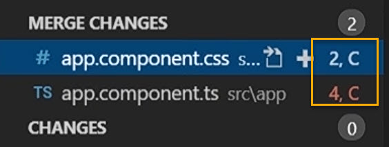

For each file:

* Click it and scan through to see the conflicts.

* For each conflict, select an option to Accept **Incoming** Change (GitHub) or Accept **Current** Change (local) changes, or choose Accept **Both** Changes and edit it manually.

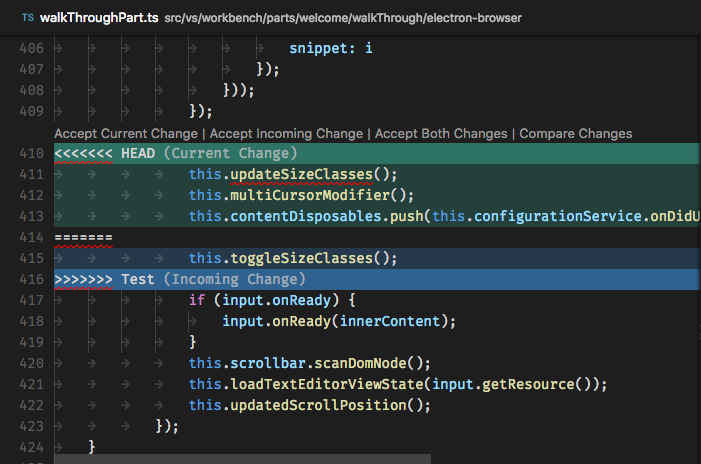

* When you are done: **don't forget to save**! It is surprisingly common to see code issues from unsaved conflict fixes.
* Once all conflicts are resolved, click the + button in the Source Control section to stage the resolved version.
* Optionally, commit and push your resolved merge.

# Special Considerations

## .gitignore

You'll often want git to ignore certain files and not push them to the remote. To do so, add a .gitignore to the project folder using the add-file functionality in VS Code and add the files.

See detailed information at https://git-scm.com/docs/gitignore.

## Non-Text Files

Files like images, Excel documents, and PDFs do not have text representations and cannot be tracked line-by-line in Git. Instead, Git will track the entire file. You'll know if it changed and still have access to prior versions, but Git won't be able to show you exactly what changed.

For images, VS Code will show you the prior and new versions of the images. For most other files, it'll tell you a preview is not available.

Once you start using Git, you'll probably want to find text-based alternatives to compressed files. Formats like Markdown and CSV can be useful replacements to let you use Git for non-code-based projects.

## Moving/Renaming a File

If you move a file, Git will see this as the file being deleted and added and any changes will be hard to see. If you can, **be very careful choosing initial file names and don’t move files**. 

>  **Tip**: use letters instead of numbers to order files. There are 26 letters so this gives you more sorting power compared to only 10 numbers. 

If you must change names, make sure to **do the name change in its' own commit**. If you stage the delete and add operations together, it'll show as R = rename.

Then, stage and commit changes separately. That way you can actually see the changes line by line. If you do both in one commit, it'll show the old file being deleted and the new different file being added, with no line-by-line comparison.

## Password Setup in Git Bash

You’ll want to save your password in Git Bash so you won’t have to type it every time you push or pull. Saving this way will also save it for VS Code.

Set up Git Bash to **remember your password** by running this code:

`git  config --global credential.helper wincred`  

This tells Git to save your password the next time you enter it. 

Run a pull or push operation in Git Bash. It's fine if there aren't any changes. Git Bash will ask you for your password. Enter the password. If the process worked, you won’t have to enter your password again. 

You may need to repeat these steps when working on a new repo.

## Repository Not Found (Fixing a Remote)

If the name or location of the remote repo is changed, you’ll git an error message that it can't be found.

To fix this, modify and run the code below in Git Bash:

```git
git remote set-url origin https://git-url.git
git pull  
```
## Clearing Sensitive Data

If you accidentally push a data file or other sensitive information, it isn't enough to just delete and re-commit. The data will still be saved in the history. To fully scrub this data from your repo:

* If it's just one commit, undo the commit using the ... menu in VS Code's Source Control tab.
  * If you didn't push the commit, you are done. 
  * If you did, you can push the undo by running `git push -f`. If someone else already pulled your change then this will break their repo. If this happens, they'll need to re-clone the repo.
* If it is in multiple commits, replace "path/to/your-file" with the file you want to remove, this can be a wildcard reference such as "all/files/in/folder/" and run the code below. See [this article](https://help.github.com/articles/removing-sensitive-data-from-a-repository/) for more detailed information and troubleshooting. When you are done, your collaborators will also need to re-clone the repo.

```
git filter-branch --force --index-filter \
  "git rm --cached --ignore-unmatch path/to/your-file" \
  --prune-empty --tag-name-filter cat -- --all
git push origin --force --all
git push origin --force --tags
git for-each-ref --format="delete %(refname)" refs/original | git update-ref --stdin
git reflog expire --expire=now --all
git gc --prune=now
```

* This may take a while to run. Once it is finished, push to the remote repo. You may need to push with the -force keyword.
* Add your file with sensitive data to a .gitignore file to ensure that you don't accidentally commit it again.