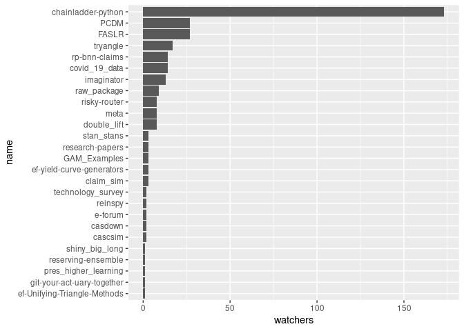
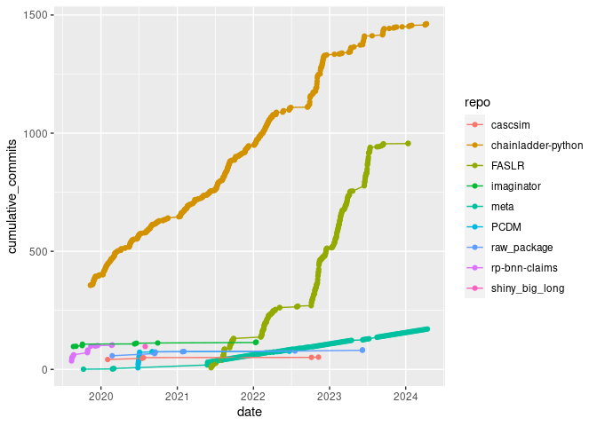

# Overview

This file was updated on 2022-04-24.

This document will provide a basic overview of the volume of and
interaction with the CAS GitHub organizational account. The account was
established in August of 2019.

## Repos

As a reminder, a repository — typically referred to as a “repo”, for
short — is the unit of measure for a single project. A repo may contain
more than one file, and in fact, most repos contain multiple files.

## By date

As of 2022-04-24, there are 24 repositories on the site.

The cumulative count of repos is shown in Figure
@ref(fig:cumulative\_repo). We note that we begin with ten repos as of
the day that the account was established. This is a result of several
repos which predate the CAS’ account having been transferred from other
owners to the CAS.


## By language

Where there is a predominant language for the repo, GitHub will indicate
it. Of those repos with a single predominant language, the number of
repos is as follows.


## Watchers



<!--
## Stars


-->

## Forks


<!-- Maybe add some stuff about words in the description or some shit. -->

# Contributions

## Commits

There have been 2,076 commits in total.

The top ten repos by number of commits are:

<table>
<thead>
<tr class="header">
<th style="text-align: left;">repo</th>
<th style="text-align: right;">total_commits</th>
</tr>
</thead>
<tbody>
<tr class="odd">
<td style="text-align: left;">chainladder-python</td>
<td style="text-align: right;">1088</td>
</tr>
<tr class="even">
<td style="text-align: left;">FASLR</td>
<td style="text-align: right;">254</td>
</tr>
<tr class="odd">
<td style="text-align: left;">imaginator</td>
<td style="text-align: right;">116</td>
</tr>
<tr class="even">
<td style="text-align: left;">rp-bnn-claims</td>
<td style="text-align: right;">104</td>
</tr>
<tr class="odd">
<td style="text-align: left;">shiny_big_long</td>
<td style="text-align: right;">97</td>
</tr>
<tr class="even">
<td style="text-align: left;">raw_package</td>
<td style="text-align: right;">76</td>
</tr>
<tr class="odd">
<td style="text-align: left;">PCDM</td>
<td style="text-align: right;">75</td>
</tr>
<tr class="even">
<td style="text-align: left;">meta</td>
<td style="text-align: right;">74</td>
</tr>
<tr class="odd">
<td style="text-align: left;">cascsim</td>
<td style="text-align: right;">50</td>
</tr>
<tr class="even">
<td style="text-align: left;">covid_19_data</td>
<td style="text-align: right;">38</td>
</tr>
</tbody>
</table>

The cumulative growth of commits over time has been:


<!-- Show commits over time for each repo separately. 




```
## <ggproto object: Class FacetWrap, Facet, gg>
##     compute_layout: function
##     draw_back: function
##     draw_front: function
##     draw_labels: function
##     draw_panels: function
##     finish_data: function
##     init_scales: function
##     map_data: function
##     params: list
##     setup_data: function
##     setup_params: function
##     shrink: TRUE
##     train_scales: function
##     vars: function
##     super:  <ggproto object: Class FacetWrap, Facet, gg>
```


-->

## Commiters

The ten most frequent contributors to various repos are:

<table>
<thead>
<tr class="header">
<th style="text-align: left;">author</th>
<th style="text-align: right;">n</th>
</tr>
</thead>
<tbody>
<tr class="odd">
<td style="text-align: left;">jbogaardt</td>
<td style="text-align: right;">740</td>
</tr>
<tr class="even">
<td style="text-align: left;">genedan</td>
<td style="text-align: right;">326</td>
</tr>
<tr class="odd">
<td style="text-align: left;">ResearchActuary</td>
<td style="text-align: right;">206</td>
</tr>
<tr class="even">
<td style="text-align: left;">kennethshsu</td>
<td style="text-align: right;">116</td>
</tr>
<tr class="odd">
<td style="text-align: left;">kevinykuo</td>
<td style="text-align: right;">110</td>
</tr>
<tr class="even">
<td style="text-align: left;">PirateGrunt</td>
<td style="text-align: right;">109</td>
</tr>
<tr class="odd">
<td style="text-align: left;">cbalona</td>
<td style="text-align: right;">27</td>
</tr>
<tr class="even">
<td style="text-align: left;">windwill</td>
<td style="text-align: right;">25</td>
</tr>
<tr class="odd">
<td style="text-align: left;">JJNewkirk</td>
<td style="text-align: right;">12</td>
</tr>
<tr class="even">
<td style="text-align: left;">aadler</td>
<td style="text-align: right;">8</td>
</tr>
</tbody>
</table>

Authors who have worked on multiple repositories are:

<table>
<thead>
<tr class="header">
<th style="text-align: left;">author</th>
<th style="text-align: right;">n</th>
</tr>
</thead>
<tbody>
<tr class="odd">
<td style="text-align: left;">ResearchActuary</td>
<td style="text-align: right;">19</td>
</tr>
<tr class="even">
<td style="text-align: left;">PirateGrunt</td>
<td style="text-align: right;">6</td>
</tr>
<tr class="odd">
<td style="text-align: left;">genedan</td>
<td style="text-align: right;">3</td>
</tr>
<tr class="even">
<td style="text-align: left;">cbalona</td>
<td style="text-align: right;">2</td>
</tr>
<tr class="odd">
<td style="text-align: left;">jbogaardt</td>
<td style="text-align: right;">2</td>
</tr>
<tr class="even">
<td style="text-align: left;">kant</td>
<td style="text-align: right;">2</td>
</tr>
<tr class="odd">
<td style="text-align: left;">kevinykuo</td>
<td style="text-align: right;">2</td>
</tr>
<tr class="even">
<td style="text-align: left;">windwill</td>
<td style="text-align: right;">2</td>
</tr>
</tbody>
</table>

## Pull requests

Pull requests take place when a GitHub user submits an improvement or
correction to be considered by the maintainer of the repo.

Metrics coming soon.
